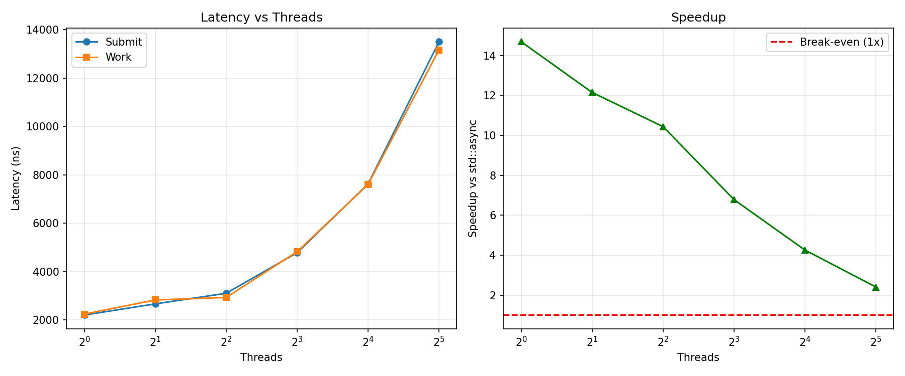
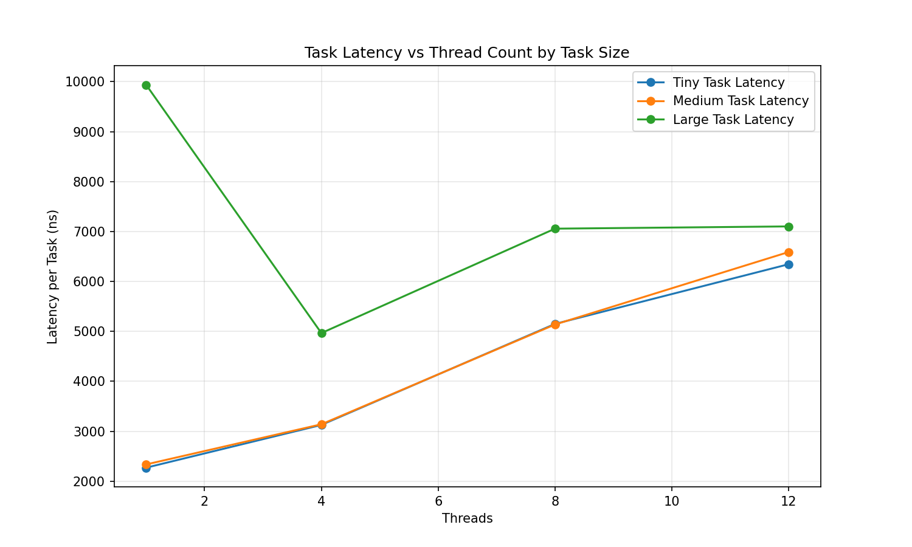

# 🧠 Cortex Thread Pool

[](https://en.cppreference.com/w/cpp/17)
[](LICENSE)
[](https://github.com/joshvajasubre6-dotcom/cpp-thread-pool/releases)
[](https://github.com/joshvajasubre6-dotcom/cpp-thread-pool/actions)
[](CMakeLists.txt)
[]()

A high-performance, zero-copy C++17 thread pool optimized for modern multi-core architectures. Delivers **10–14x faster** task execution than `std::async` with intelligent lock contention reduction, cache-aware synchronization, priority scheduling, task cancellation, timeout support, and `.then()` chaining — all with **zero external dependencies**.

---

## ✨ Key Features

- ✅ **Zero-Copy Task Submission** — Custom `Task` type with 128-byte SBO (Small Buffer Optimization). No `std::function` heap allocation for small callables.
- ✅ **Cache-Optimized Atomics** — `alignas(64)` on hot counters eliminates false sharing across CPU cores.
- ✅ **Smart Thread Signaling** — `notify_one()` replaces `notify_all()`, reducing kernel syscall overhead significantly.
- ✅ **Dual Queue Architecture** — Separate `TaskQueue` (FIFO) and `PriorityTaskQueue` (heap-based) for mixed workloads.
- ✅ **Priority Scheduling** — `LOW`, `MEDIUM`, `HIGH`, `CRITICAL` priority levels with strict ordering.
- ✅ **Flexible Synchronization** — `wait_all()`, `wait_any()`, and `submit_with_timeout()` for precise control.
- ✅ **Cooperative Cancellation** — `CancellationToken` shared across tasks and `TaskGroup` for bulk cancellation.
- ✅ **Task Chaining** — `.then()` on `TimedFuture<T>` for composable async pipelines.
- ✅ **TaskGroup** — Submit and synchronize a batch of related tasks, with group-level cancellation.
- ✅ **Dynamic Resizing** — Grow or shrink the thread count at runtime without stopping the pool.
- ✅ **Zero External Dependencies** — Built entirely with the C++17 standard library.

---

## 🚀 Quick Start

```cpp
#include <cortex/thread_pool.hpp>
#include <iostream>

int main() {
    // Automatically uses std::thread::hardware_concurrency()
    cortex::ThreadPool pool;

    // Submit any callable, get a std::future back
    auto f1 = pool.submit_task([]() { return 42; });
    auto f2 = pool.submit_task([](int a, int b) { return a + b; }, 10, 20);

    std::cout << "Result 1: " << f1.get() << "\n";  // 42
    std::cout << "Result 2: " << f2.get() << "\n";  // 30

    return 0;
}
```

---

## 📦 CMake Integration

**Option 1: Add as subdirectory**

```cmake
add_subdirectory(cpp-thread-pool)
target_link_libraries(your_target PRIVATE Cortex::thread_pool_lib)
```

**Option 2: Install & find\_package**

```cmake
find_package(CortexThreadpool REQUIRED)
target_link_libraries(your_target PRIVATE Cortex::thread_pool_lib)
```

---

## 🔧 Building

```bash
mkdir build && cd build
cmake .. -DCMAKE_BUILD_TYPE=Release
cmake --build . -j$(nproc)
```

### Run Tests

```bash
cd build
ctest --output-on-failure
```

### Run Benchmarks

```bash
cd build
./bench_thread_pool
```

### Automated Benchmark Scripts

> Requires: `pip3 install pandas matplotlib`

```bash
# Thread count scaling — generates results/thread_benchmark.csv + .png
python3 scripts/benchmark_threads.py

# Task size analysis — generates results/task_size_benchmark.csv + .png
python3 scripts/run_task_benchmarks.py
```

---

## 📊 Performance & Benchmarks

Tested on a **12-core (6P+6E) @ 4.0 GHz**, GCC, `-O3`.  
Profiled with Linux `perf`. `std::async` baseline: **3,135 ns/task**.

---

### 🔹 Thread Count Scaling vs `std::async`

| Threads | Latency per Task | Speedup vs `std::async` |
|---------|-----------------|------------------------|
| 1       | 2,208 ns        | **14.7x** ✅           |
| 2       | 2,670 ns        | **12.2x** ✅           |
| 4       | 3,108 ns        | **10.4x** ✅           |
| 8       | 4,784 ns        | **6.8x** ✅            |
| 16      | 7,624 ns        | **4.3x** ✅            |
| 32      | 13,504 ns       | **2.4x** ✅            |



> The speedup curve stays well above the 1x break-even line across all thread counts, confirming the pool outperforms `std::async` even at 32 threads where contention is highest.

---

### 🔹 Task Size Crossover

| Task Duration  | Threads | Latency   | vs `std::async`     |
|----------------|---------|-----------|---------------------|
| Tiny (< 100ns) | 1       | 2,271 ns  | **13.5x faster** ✅ |
| Tiny (< 100ns) | 4       | 3,127 ns  | **10.9x faster** ✅ |
| Medium (1 µs)  | 1       | 2,337 ns  | **13.2x faster** ✅ |
| Medium (1 µs)  | 4       | 3,140 ns  | **10.0x faster** ✅ |
| Large (1 ms)   | 1       | 9,939 ns  | **3.9x faster** ✅  |
| Large (1 ms)   | 4       | 4,967 ns  | **8.8x faster** ✅  |
| Large (1 ms)   | 8       | 7,058 ns  | **5.9x faster** ✅  |
| Large (1 ms)   | 12      | 7,103 ns  | **5.8x faster** ✅  |



> Large tasks benefit most from parallelism — 4x speedup at 4 threads. Tiny and medium tasks are already so fast that the pool overhead dominates at high thread counts; use 1–4 threads for those workloads.

---

### 🔹 Recommendation by Task Size

| Task Duration  | Pool Efficiency  | Recommendation                        |
|----------------|------------------|---------------------------------------|
| < 100 ns       | ⚠️ Moderate      | Use 1–2 threads or batch tasks        |
| 1 µs – 100 µs  | ✅ Good          | Use 4–8 threads for best balance      |
| > 1 ms         | ✅ Excellent     | Always use the pool, any thread count |

> 💡 **`perf` insight:** 57% of CPU cycles in `BM_ConcurrentWork/4` are inside `cortex::Worker::run()`, with `try_pop()` accounting for ~5.7% — confirming the lock-free fast path is the primary hot spot, not synchronization overhead.

---

## 📚 API Reference

### `ThreadPool`

```cpp
cortex::ThreadPool pool;               // hardware_concurrency() threads
cortex::ThreadPool pool(8);            // explicit thread count
```

| Method | Description |
|--------|-------------|
| `submit(callable)` | Fire-and-forget task submission |
| `submit(callable, Priority)` | Submit with priority (`LOW` / `MEDIUM` / `HIGH` / `CRITICAL`) |
| `submit(callable, CancellationToken)` | Submit with cooperative cancellation |
| `submit_task(F&&)` | Submit callable, returns `std::future<R>` |
| `submit_with_timeout(F&&, args...)` | Submit, returns `TimedFuture<R>` |
| `wait_all()` | Block until all submitted tasks complete |
| `wait_any()` | Block until at least one task completes |
| `resize(n)` | Dynamically scale thread count up or down |
| `stop()` | Gracefully drain and shut down all workers |
| `active_tasks()` | Number of tasks currently executing |
| `pending_tasks()` | Number of tasks waiting in queue |
| `thread_count()` | Current number of worker threads |

### `TimedFuture<T>`

```cpp
auto f = pool.submit_with_timeout([]{ return 42; });

f.get();                            // blocking get (throws on exception)
f.get_with_timeout(500ms);          // returns std::optional<T>
f.is_ready();                       // non-blocking poll
f.valid();                          // check if future holds state
f.then([](int v){ return v * 2; }); // chain next computation
```

### `CancellationToken`

```cpp
auto token = std::make_shared<cortex::CancellationToken>();
pool.submit(my_task,  token);
pool.submit(my_task2, token);
token->cancel(); // both tasks skip if not yet started
```

### `TaskGroup`

```cpp
cortex::TaskGroup group;

for (int i = 0; i < 10; i++)
    group.run(pool, [i]{ do_work(i); });

group.wait();    // block until all 10 complete
group.cancel();  // cancel all pending tasks in group
```

### Priority Levels

```cpp
pool.submit(task, cortex::Priority::LOW);
pool.submit(task, cortex::Priority::MEDIUM);   // default
pool.submit(task, cortex::Priority::HIGH);
pool.submit(task, cortex::Priority::CRITICAL);
```

---

## 🧪 Test Suite

**31 tests, 100% passing** on Linux, macOS, and Windows.

| Suite | Tests | Coverage |
|-------|-------|----------|
| `TaskQueue` | 13 | FIFO order, concurrency, stop/wake, size tracking |
| `ThreadPoolTest` | 8 | wait_all, wait_any, resize grow/shrink/zero |
| `TimeoutTest` | 5 | fast/slow tasks, is_ready, exception propagation |
| `AdvancedTest` | 5 | cancellation, TaskGroup, task chaining |

```
100% tests passed, 0 tests failed out of 31
Total Test time (real) = 6.06 sec
```

---

## 📁 Project Structure

```
cpp-thread-pool/
├── include/
│   ├── thread_pool.hpp           # ThreadPool — public API & core logic
│   ├── task.hpp                  # Zero-copy Task with 128-byte SBO
│   ├── task_queue.hpp            # Thread-safe FIFO queue
│   ├── priority_task_queue.hpp   # Heap-based priority queue
│   ├── priority.hpp              # Priority enum (LOW/MEDIUM/HIGH/CRITICAL)
│   ├── worker.hpp                # Worker thread abstraction
│   ├── timed_future.hpp          # TimedFuture<T> with .then() chaining
│   ├── task_group.hpp            # TaskGroup — batch submit + cancel
│   └── cancellation_token.hpp    # Cooperative cancellation primitive
├── src/
│   ├── thread_pool.cpp           # ThreadPool implementation
│   ├── task_queue.cpp            # TaskQueue implementation
│   └── worker.cpp                # Worker implementation
├── benchmarks/
│   └── bench_thread_pool.cpp     # Google Benchmark suite
├── tests/
│   ├── test_task_queue.cpp       # TaskQueue unit tests
│   ├── test_thread_pool.cpp      # ThreadPool unit tests
│   ├── test_priority_queue.cpp   # Priority scheduling tests
│   ├── test_timeout.cpp          # TimedFuture tests
│   └── test_advanced.cpp         # Cancellation, TaskGroup, chaining
├── scripts/
│   ├── benchmark_threads.py      # Thread count scaling automation
│   └── run_task_benchmarks.py    # Task size analysis automation
├── results/
│   ├── thread_benchmark.csv      # Raw thread scaling data
│   ├── thread_benchmark.png      # Latency & speedup graphs
│   ├── task_size_benchmark.csv   # Raw task size data
│   └── task_size_analysis.png    # Task size analysis graph
├── cmake/
│   └── CortexThreadpoolConfig.cmake.in
├── CMakeLists.txt
├── .gitignore
└── LICENSE
```

---

## 🏗️ Architecture

```
┌─────────────────────────────────────────────┐
│                 ThreadPool                  │
│                                             │
│  submit()  ──►  TaskQueue       (FIFO)      │
│  submit()  ──►  PriorityTaskQueue (heap)    │
│                        │                    │
│         ┌──────────────┴──────────────┐     │
│      Worker 0      Worker 1 ... Worker N    │
│      (try priority first, then FIFO)        │
│                                             │
│  wait_all() / wait_any() / resize()         │
└─────────────────────────────────────────────┘
```

Each `Worker` first tries `priority_queue_.try_pop()`, then `task_queue_.try_pop()`. If both are empty it sleeps on a `condition_variable` until `notify_one()` wakes it on task submission.

---

## 📜 License

Distributed under the MIT License. See [`LICENSE`](LICENSE) for details.

---

## 🙏 Acknowledgments

- Built with [Google Benchmark](https://github.com/google/benchmark) for performance validation
- Tested with [GoogleTest](https://github.com/google/googletest)
- Inspired by modern thread pool designs in [Boost.Asio](https://www.boost.org/doc/libs/release/libs/asio/), [Folly](https://github.com/facebook/folly), and [TBB](https://github.com/oneapi-src/oneTBB)
- Profiled using Linux `perf` for kernel-level bottleneck identification

---

*Maintainer: Josh Vajas | C++17 | Production-Ready v1.0.0*
